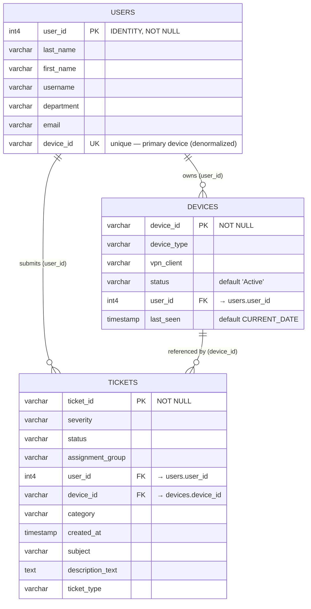

# Entity Relationship Diagram — `demo` Schema

## Relationships

| Relationship | Cardinality | Foreign Key | Description |
|---|---|---|---|
| `USERS` → `DEVICES` | One-to-many | `devices.user_id → users.user_id` | A user can own multiple devices. `users.device_id` (UNIQUE) is a denormalized back-reference to the user's primary device for fast lookups. |
| `USERS` → `TICKETS` | One-to-many | `tickets.user_id → users.user_id` | A user can have many support tickets. |
| `DEVICES` → `TICKETS` | One-to-many | `tickets.device_id → devices.device_id` | A ticket can be linked to the specific device involved in the issue. |

## Indexes on `demo.tickets`

| Index | Column | Purpose |
|---|---|---|
| `idx_tickets_user_id` | `user_id` | Fast lookup of all tickets for a given user |
| `idx_tickets_status` | `status` | Filter tickets by status (Open, Resolved, etc.) |
| `idx_tickets_created_at` | `created_at` | Range queries and sorting by creation date |

## Notes

- `users.device_id` carries a `UNIQUE` constraint but **no explicit FK** in the DDL — it is a convenience column. The authoritative ownership direction is `devices.user_id → users.user_id`.
- All three tables live in the `demo` schema.
- `users.user_id` is an `IDENTITY` column (auto-increment); all other PKs are application-assigned `varchar` values.
